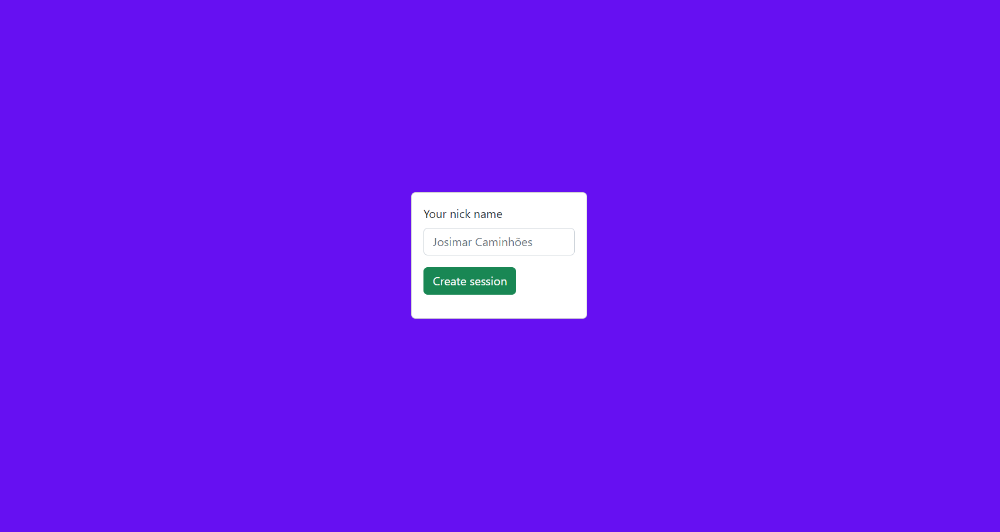
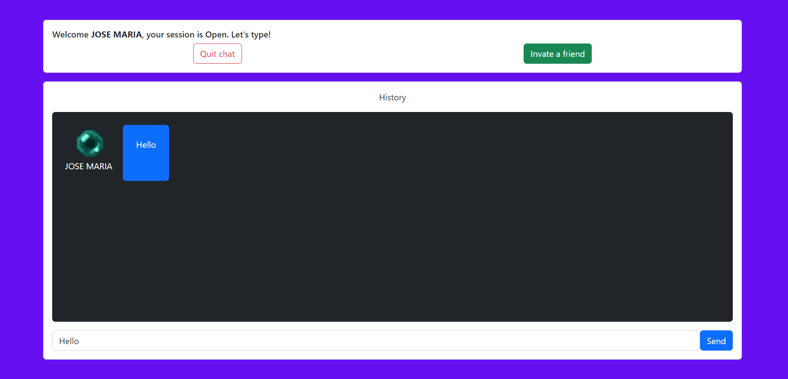

# gofiber-simple-chat

In this project i tried to implement a simple communication between two clients using websocket with golang, in interface was used react.


## Requirements

* golang 1.19.4
* node latest (v19.7.0)

## API Docs

#### Start a websocket connection

```http
  GET /ws/:id/:userID
```

| Parâmetro   | Tipo       | Descrição                           |
| :---------- | :--------- | :---------------------------------- |
| `id` | `string` | **Required** session id |
| `userID` | `string` | **Required** user id |

#### Create uuid to session

```http
  GET /create-session-id
```

#### UI



